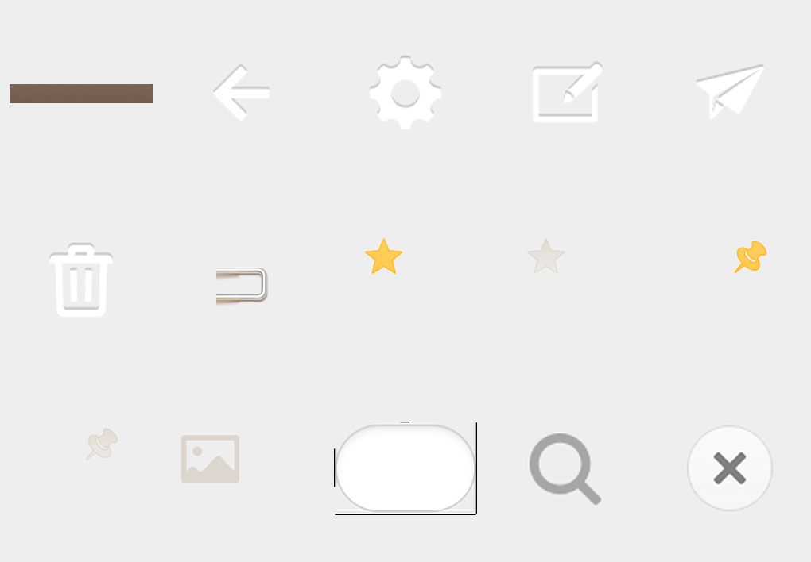

# 安卓版锤子便签 4.2.1 设计参考

本目录是从用户设备 `Download` 目录中的 APK 做资源级静态解包后，按便签核心界面的实际引用关系筛选出的设计参考。

## APK 信息

- 包名：`com.smartisan.notes`
- 版本：`4.2.1`
- versionCode：`42100`
- APK SHA-256：`ea7249a92756d3c36592beb216d5c9bd74a3a1b0cbcd0a9f74aa738532eb104f`
- 分析方式：`apktool --no-src`，只解码 Manifest 和资源，不反编译业务代码
- 资源密度：本目录保留客户端在 `xxhdpi` 下使用的原始文件，换算设计尺寸时除以 `3`

这些资源的权利仍属于原应用权利方。本目录用于本项目内部的兼容性分析和视觉比对，不应整包再分发，也不要在未确认授权的情况下直接作为产品素材发布。

## 目录内容

```text
assets/drawable-xxhdpi/  顶栏、按钮、列表纸片、木纹、搜索框等原始图片
layouts/                 便签主界面、列表、详情和顶栏的反编译布局 XML
selectors/               普通、按下、禁用等状态之间的资源映射
contact-sheet.png        核心资源速览图
```



## 可直接核对的尺寸

| 元素 | APK 依据 | 设计尺寸 |
| --- | --- | --- |
| 手机端顶栏 | `titlebar_height`；`action_bar_default.png` 为 1080 × 144 px | `48dp` |
| 顶栏按钮 | `TitleBarButton`；按钮 PNG 为 108 × 108 px | `36 × 36dp`，上边距 `6dp`，右边距 `6dp` |
| 顶栏标题 | `TitleBarTitle` | `20sp`、白色、粗体、单行居中 |
| 列表纸片可见区域 | `list_item_bg.9.png` 去掉 9-patch 标记后为 284 × 226 px | 约 `94.7 × 75.3dp`，横向拉伸 |
| 列表左侧装订夹 | `note_item_clip_normal.png` 为 86 × 226 px | 约 `28.7 × 75.3dp` |
| 列表内容左边距 | `list_item_content_padding_left` | `52dp` |
| 列表内容右边距 | `list_item_content_padding_right` | `20dp` |
| 时间区域高度 | `list_item_time_height` | `24dp` |
| 列表标题 | `list_detail_text_size` | `16.5sp`，单行 |
| 列表时间 | `time_text_size` | `12sp` |
| 详情正文 | `detail_notes_text_size` | `16sp` |
| 详情标题 | `detail_notes_title_size` | `18sp` |
| 详情正文左右内边距 | `detail_notes_text_padding_left/right` | `39dp / 18dp` |
| 详情行高基准 | `detail_notes_line_height` | `42dp` |
| 长图中的图片底板 | `longlength_weibo_image_bg.9.png` | 暖灰外线、暖白衬边与极轻底部阴影，无圆角 |
| 搜索文字 | `search_bar_input_editor_text_size` | `15sp` |
| 搜索框内部边距基准 | `right_container_margin` | `6dp` |

## 可直接核对的颜色

APK 的纸张和顶栏图片包含纹理与渐变，不能用一个纯色完全表示。下面同时记录资源色值和代表性像素：

| 用途 | 值 |
| --- | --- |
| 列表标题 | `#FF5C3C2A` |
| 列表时间 | `#705C3C2A`（ARGB，约 44% 不透明度） |
| 详情文字 | `#D15C3C2A`（ARGB，约 82% 不透明度） |
| 详情引用文字 | `#FF9E836C` |
| 编辑器文字 | `#CC000000` |
| 编辑器占位文字 | `#26000000` |
| 顶栏标题 | `#FFFFFFFF` |
| 顶栏标题阴影 | `#FF453D3B` |
| 普通列表纸片中心代表像素 | `#F9F6ED` |
| 按下列表纸片中心代表像素 | `#E0DDD5` |
| 顶栏顶部 / 中部 / 底部代表像素 | `#796455 / #776153 / #735D4E` |

## 结构与状态结论

- 手机列表和编辑详情是独立页面状态，不是同一长页面中的上下堆叠区域。
- 列表项不是一块纯色矩形；`list_item_back.xml` 在普通态和按下态之间切换两张 9-patch 纸片。
- 列表纸片已经内置 1px 细线、左侧页边线、圆角和底部阴影。若用 Web CSS 重做，应复现这些层次，而不是再叠明显色条。
- 左侧装订夹、右侧收藏/置顶/图片状态都占用各自的透明画布；文字的 `52dp` 左边距正是为了避开装订夹。
- 返回、设置、新建、分享、删除等顶栏按钮使用统一的 `36dp` 画布，放在 `48dp` 顶栏里。
- 搜索框、列表项和清除按钮都通过 selector 区分普通、按下或禁用状态。
- 长图分享预览由 `Convert2PicturePreviewActivity` 使用
  `convert_to_picture_preview_weibo_image_item.xml` 渲染；图片外层不是普通
  `border`，而是 `longlength_weibo_image_bg.9.png` 提供的暖灰细线、白色衬边和
  极浅底部阴影。1080 × 2400 真机截图中的代表像素为外线约 `#EBE8E3`、
  衬边 `#FFFFFF`，四角保持直角。

## 关键文件入口

- 顶栏结构：`layouts/notes_titlebar.xml`
- 列表条目结构：`layouts/list_notes_item.xml`
- 列表普通/按下态：`selectors/list_item_back.xml`
- 列表页面：`layouts/fragment_list.xml`
- 编辑详情页面：`layouts/fragment_detail.xml`
- 详情图片：`layouts/detail_note_item_image.xml`
- 长图分享图片：`layouts/convert_to_picture_preview_weibo_image_item.xml`
- 搜索框：`layouts/search_bar.xml`
