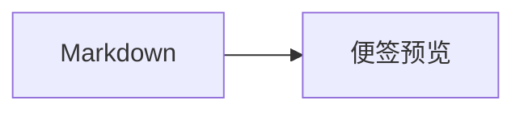

[# **Markdown 全样式测试模板**]

> 这份模板用于一次性检查开源版锤子便签当前支持的常用 Markdown、GFM 扩展和项目自定义排版。可整份复制到编辑器，也可以按 `##` 分节单独测试。

测试信息：中文 / English / 123456 / 「标点」 / 😀 🚀 ✅

## 01 标题与段落

# H1 一级标题

当前的 `## H2` 会被锤子便签识别为新的预览卡片分节标题，本行所在的“01 标题与段落”就是 H2 的实际效果。

### H3 三级标题

#### H4 四级标题

##### H5 五级标题

###### H6 六级标题

这是一个普通段落，用来检查字体、字号、字色、行高，以及中英文混排 ABC 123 的显示效果。

这是第二个普通段落。它和上一段之间保留了一个 Markdown 空行。

这一行后面只有一次普通换行。
项目会把这一行显示为一个手动换行段落。

这一行末尾使用反斜杠。\
这一行用于检查 Markdown 硬换行。

## 02 行内文字样式

普通文字、**星号粗体**、__下划线粗体__、*星号斜体*、_下划线斜体_、***粗斜体***、~~删除线~~。

组合样式：**粗体中的 _斜体_**、~~删除线中的 **粗体**~~、`行内代码中的 <tag>`。

中英文边界：前文**重点内容**后文，English **bold words** continue。

Emoji 与符号：😀 🚀 ✅ 🔥 🎉 · © ® ™ ± × ÷ ≠ ≤ ≥ → ← ↑ ↓。

## 03 链接

[普通命名链接](https://github.com/zhaoolee/notes)

[带标题的链接](https://github.com/zhaoolee/notes "开源版锤子便签")

自动链接：<https://github.com/zhaoolee/notes>

GFM 裸链接：https://github.com/zhaoolee/notes

邮箱自动链接：hello@example.com

引用式链接：[项目主页][notes-home]

[notes-home]: https://github.com/zhaoolee/notes "GitHub 项目主页"

## 04 引用

> 一级引用：不要因为走得太远，就忘了当初为什么出发。
>
> 引用中也可以使用 **粗体**、*斜体*、`行内代码` 和 [链接](https://github.com/zhaoolee/notes)。
>
> > 二级嵌套引用：用于检查缩进、竖线和层级关系。

> 多段引用的第二组。
>
> - 引用中的无序列表
> - 第二个列表项

## 05 无序列表

- 一级项目 A
- 一级项目 B
  - 二级项目 B.1
  - 二级项目 B.2
    - 三级项目 B.2.1
- 一级项目 C，包含 **粗体**、`代码` 和 [链接](https://example.com)

也可以使用加号：

+ 加号项目一
+ 加号项目二

也可以使用星号：

* 星号项目一
* 星号项目二

## 06 有序列表

1. 第一个有序项目
2. 第二个有序项目
   1. 二级编号 2.1
   2. 二级编号 2.2
      1. 三级编号 2.2.1
3. 第三个有序项目

指定起始序号：

7. 从七开始
8. 接着排列
9. 最后一项

## 07 任务列表

- [x] 已完成任务
- [ ] 未完成任务
- [x] 包含 **粗体** 的任务
- [ ] 包含 `行内代码` 的任务
  - [x] 已完成的子任务
  - [ ] 未完成的子任务

## 08 表格

| 左对齐 | 居中对齐 | 右对齐 |
|:-------|:--------:|-------:|
| Alpha | Center | 100 |
| 中文内容 | 居中 | 200 |
| **粗体** | `行内代码` | 300 |
| [链接](https://example.com) | ~~删除线~~ | 400 |

窄表格：

| 状态 | 说明 |
|------|------|
| ✅ | 正常 |
| ⚠️ | 注意 |
| ❌ | 异常 |

## 09 行内代码与代码块

安装命令：`npm install`

文件名：`src/components/MarkdownText.tsx`

JavaScript 代码块：

```javascript
function greet(name) {
  return `Hello, ${name}!`;
}

console.log(greet("Markdown"));
```

JSON 代码块：

```json
{
  "theme": "default",
  "enabled": true,
  "count": 3
}
```

纯文本代码块：

```text
这里保留    连续空格
<tag> 在代码块中保持原样
**星号** 不会变成粗体
```

波浪线代码围栏：

~~~bash
npm test
npm run build
~~~

四个空格缩进的代码：

    const message = "indented code block";
    console.log(message);

## 10 分隔线

第一种分隔线：

---

第二种分隔线：

***

第三种分隔线：

___

分隔线后的正文用于检查上下间距。

## 11 图片

普通图片：


带链接的图片：

[](https://github.com/zhaoolee/notes)

列表与未缩进图片相邻，用于检查图片不会被错误吸收到列表项目中：

- 图片前的列表项

- 图片后的列表项

图片后的正文，用来检查图片宽度、圆角、加载状态和上下间距。

## 12 转义与特殊字符

转义后的格式标记：\*不是斜体\*、\_不是斜体\_、\# 不是标题、\> 不是引用。

转义后的列表标记：\- 不是列表、1\. 不是有序列表、\[不是链接括号\]。

反斜杠：\\

HTML 实体：&copy; &reg; &trade; &lt;div&gt; &amp; &quot;引号&quot;。

连续标点：…… —— ？！；：、“”‘’《》【】（）

## 13 脚注

这句话后面有一个简单脚注[^simple]。

这句话后面有一个包含格式的脚注[^rich]。

[^simple]: 这是简单脚注内容。

[^rich]: 这是包含 **粗体**、`行内代码` 与 [链接](https://example.com) 的脚注内容。

## 14 复合嵌套

1. 列表中的引用：

   > 引用内容包含 **粗体**、*斜体* 和 `代码`。

2. 列表中的代码块：

   ```bash
   npm test
   npm run build
   ```

3. 列表中的表格：

   | Key | Value |
   |-----|-------|
   | A | 123 |
   | B | 456 |

4. 列表中的任务：

   - [x] 子任务 A
   - [ ] 子任务 B

## 15 项目自定义排版

文件第一条非空内容使用 `[内容]` 包裹时，会成为居中的标题；本模板顶部的居中大标题就是实际示例。

每个以 `## ` 开头的标题会开启一张新的便签分节卡片，而不是作为普通 H2 留在上一节正文中。

[正文中出现的完整方括号会保持普通正文，因为它不在文件第一条非空内容的位置]

标题和正文都可以混用 **粗体**、*斜体*、`代码`、链接与 Emoji。

## 16 兼容性边界

当前渲染器不会执行原始 HTML，下面的标签应作为文字显示，而不是生成真正的高亮、键帽或红色文字：

<mark>HTML mark 标签</mark>

<kbd>Ctrl</kbd> + <kbd>C</kbd>

<span style="color:red">红色 HTML 文本</span>

Mermaid 和数学公式当前没有启用专用渲染插件，可用代码块安全展示源码：



```text
E = mc²
行内数学示例：$a² + b² = c²$
```

## 17 长内容与结束标记

这是一段用于观察长行自动折行的内容：开源版锤子便签会根据预览卡片宽度自动调整正文排版，因此这里刻意放入较长的中文句子、English words、数字 20260805 和 https://github.com/zhaoolee/notes，检查内容不会越过卡片边界。

测试结束标记：`MARKDOWN_FULL_STYLE_TEMPLATE_END`
