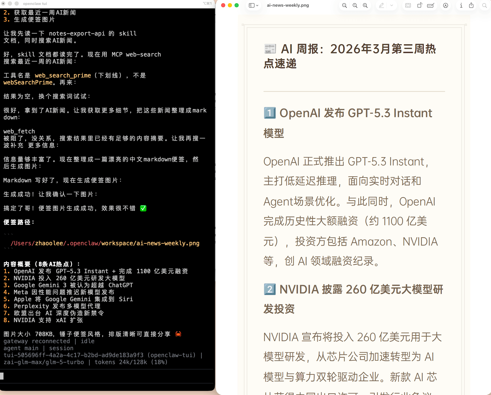
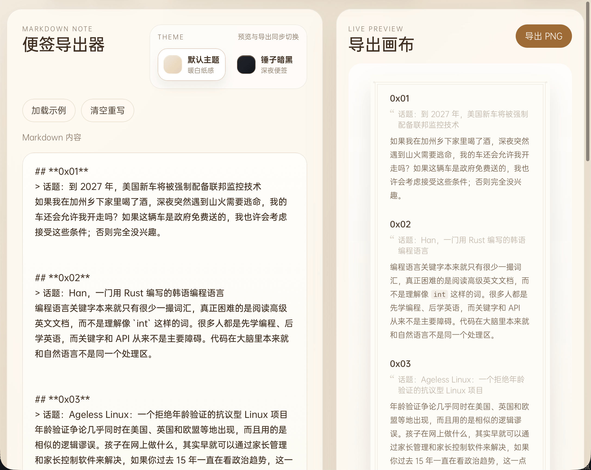
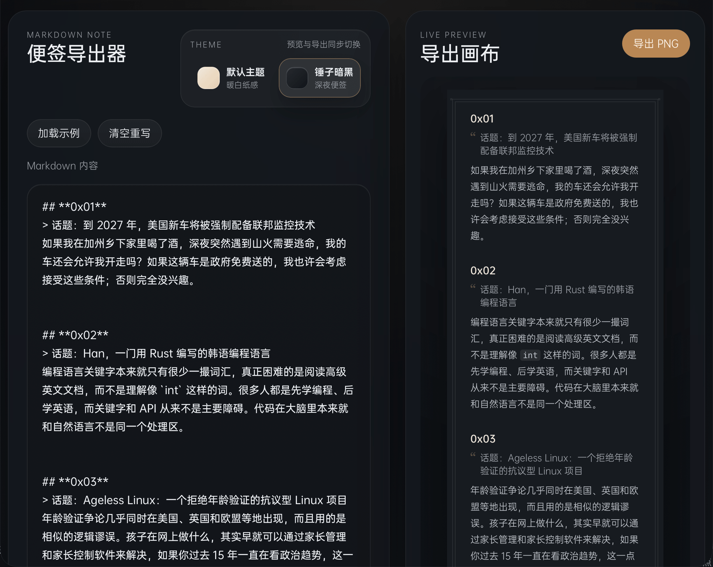
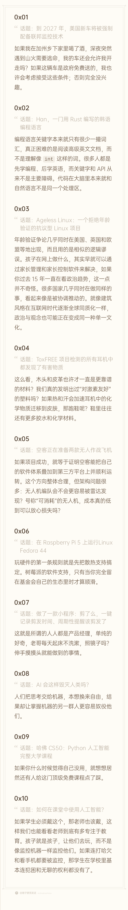
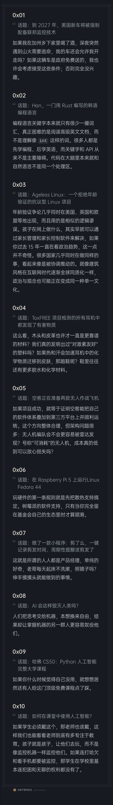

# 锤子便签Skill

一个锤子便签风格的导出器，支持暖白纸感，深夜便签两个主题，用来分享与openclaw的对话记录。

## 通过skill调用

clawhub地址 https://clawhub.ai/zhaoolee/notes-export-api

```
从clawhub安装 notes-export-api这个 skill,
联网获取最近一周 AI 相关的新闻，将新闻转化为 markdown 生成便签图片，把便签图片绝对路径返回给我，把图片往“下载”文件夹复制一份
```



## 网页版

地址：[https://notes.fangyuanxiaozhan.com](https://notes.fangyuanxiaozhan.com)









## 环境要求

- Docker
- Docker Compose

## Docker 开发环境

启动：

```bash
docker compose -f docker-compose.dev.yml up --build
```

访问地址：

- 前端：`http://127.0.0.1:5173`
- 后端导出 API：`http://127.0.0.1:3001/api/export`

说明：

- 前后端都运行在容器内
- 前端开启 Vite HMR，适合日常开发
- 后端使用 `node --watch`，修改后会自动重启
- 源码通过 volume 挂载到容器，不依赖宿主机 Node.js 环境

停止：

```bash
docker compose -f docker-compose.dev.yml down
```

## Docker 生产环境

启动：

```bash
docker compose up --build -d
```

访问地址：

- 页面：`http://127.0.0.1:18080`

说明：

- `frontend` 容器构建静态页面并通过 Nginx 提供服务
- `backend` 容器运行 Express + Playwright，负责 PNG 导出
- 生产环境只暴露前端端口 `18080`，后端仅在容器内网提供给前端调用

查看日志：

```bash
docker compose logs -f
```

停止：

```bash
docker compose down
```
