# 开源版锤子便签


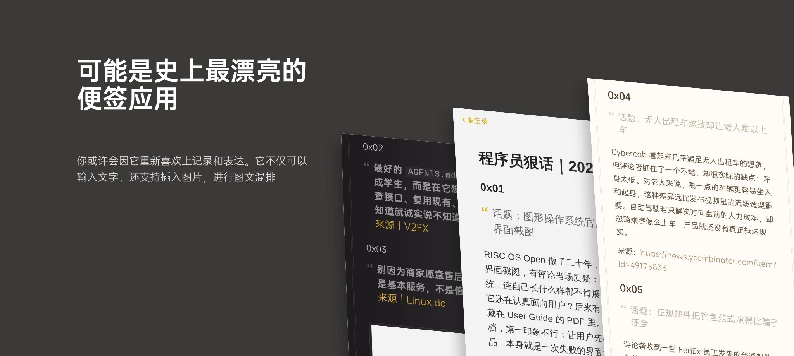


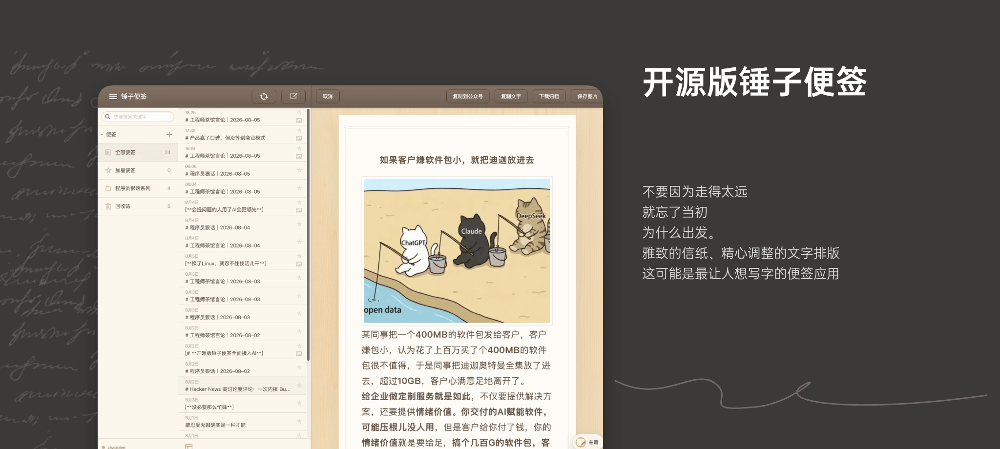

| 支持手机版 | 一键发送公众号 |
| --- | --- |
| 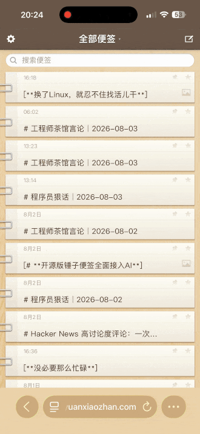 | 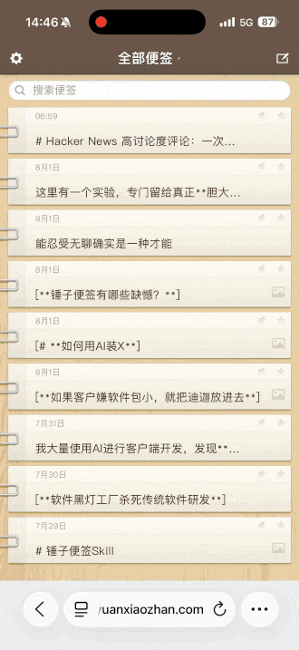 |


- 一个锤子便签风格的导出器，预览与图片导出支持**暖白纸感**、**深夜便签**、**iPhone 备忘录深浅模式**和 **Bear 极简排版**。
- 可用来分享与openclaw的对话记录。
- 完美复刻锤子便签网页版和PC版，支持多便签，分类存储。
- 支持Docker一键私有化部署
- 纯WEB应用，无需安装任何App，打开即用
- 支持PC端和手机版，多端数据同步，支持公网部署
- 支持图片插入。
- 支持一键粘贴到公众号助手。
- 支持直接导出便签为图片，或复制为markdown格式进行分享。
- 自带浏览器持久化，关闭页面也不会丢失数据。
- 开源免费，可私有化部署。
- 工匠精神沁入AI，可以通过AI Skill直接调用工具，生成便签。
- 支持自定义底部标识（点击即可编辑）
- API原生封装支持Hermes Agent，OpenClaw直接通过skill驱动管理便签
- 支持 DeepSeek Harness（DSH），让智能体将对话导出为锤子便签。
- 支持接入DeepSeek润色书写内容，语法标点检查，重点加粗，复杂概念通俗化释义。
- 支持一键下载包含图片的Markdown资源包
- 支持下载为html离线查看

## 通过DSH调用

```
dsh plugin --profile web add @zhaoolee/dsh-notes
```

安装后请重启目标 profile，使插件生效。重启后，在 DeepSeek Harness 对话中说：**把我们的对话导出成便签**， 智能体会自动整理当前对话并调用插件生成便签。

| Deepseek Harness 生成分享便签 | 导出效果 |
| --- | --- |
| 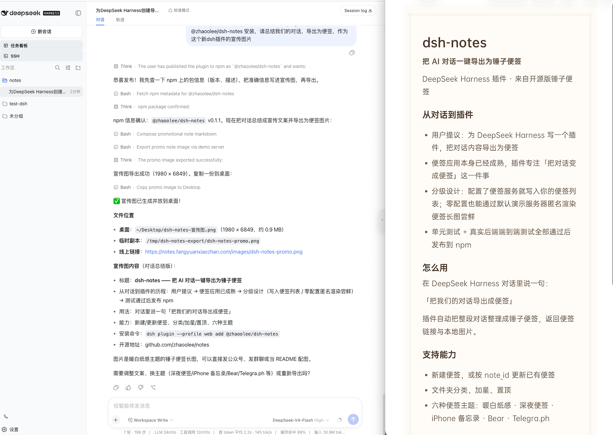 | 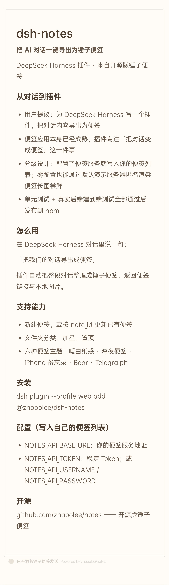 |


## 通过skill调用

clawhub地址 https://clawhub.ai/zhaoolee/notes-export-api

```
从clawhub安装 notes-export-api这个 skill,
联网获取最近一周 AI 相关的新闻，将新闻转化为 markdown 生成便签图片，把便签图片绝对路径返回给我，把图片往“下载”文件夹复制一份
```

## 支持自定义底部品牌标识(点击就能改)

只要你喜欢，可以把底部的「锤子便签」改成「凿子便签」或「榔头便签」


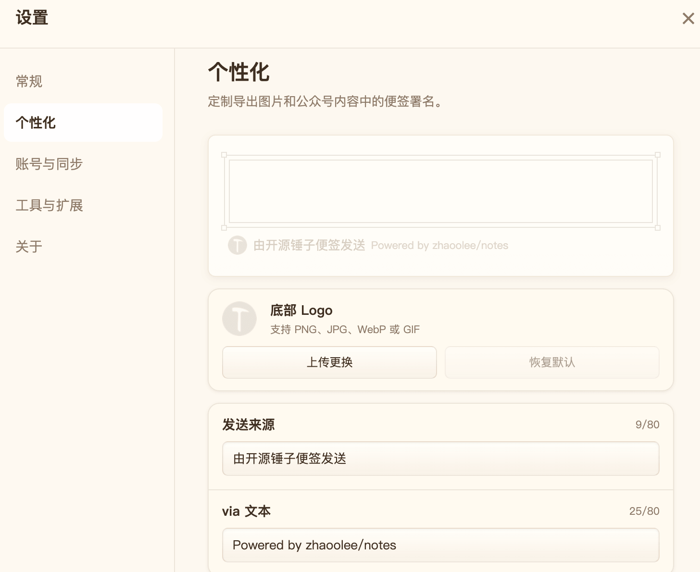


## 支持下载文章，包含网页，markdown以及管理的图片资源


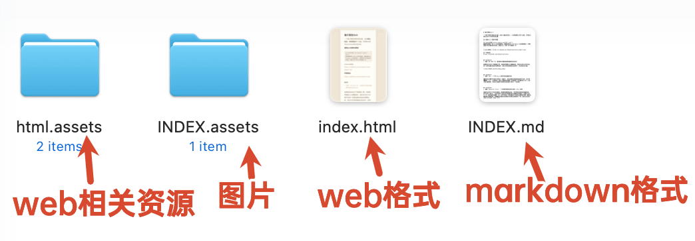

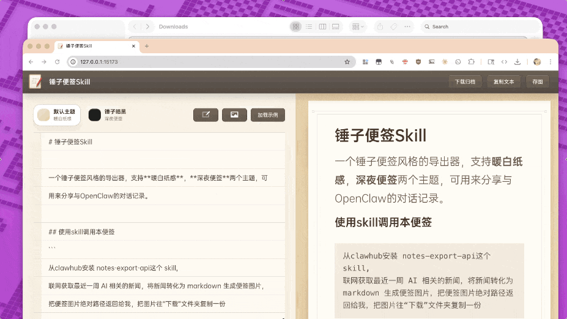

## 支持接入DeepSeek，修正语法错误，重点加粗，通俗化润色

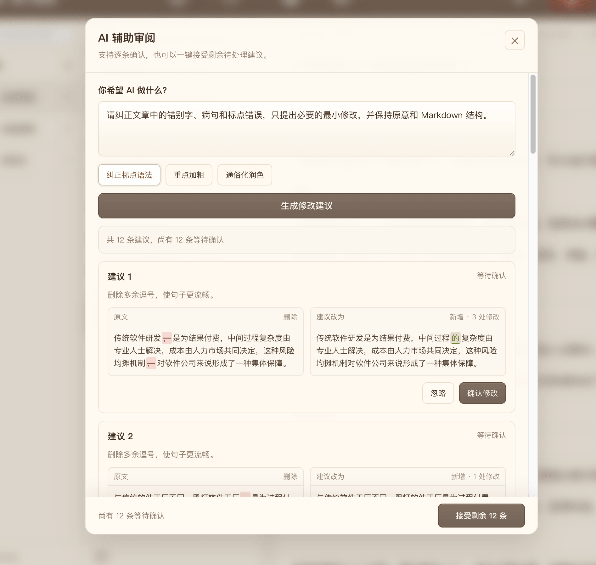

## 零配置，复制即可将权限导入hermes agent

登陆后，复制一行专属链接，粘贴给Hermes Agent或OpenClaw，即可获取包含登身份认证的skill包，实现人机协同

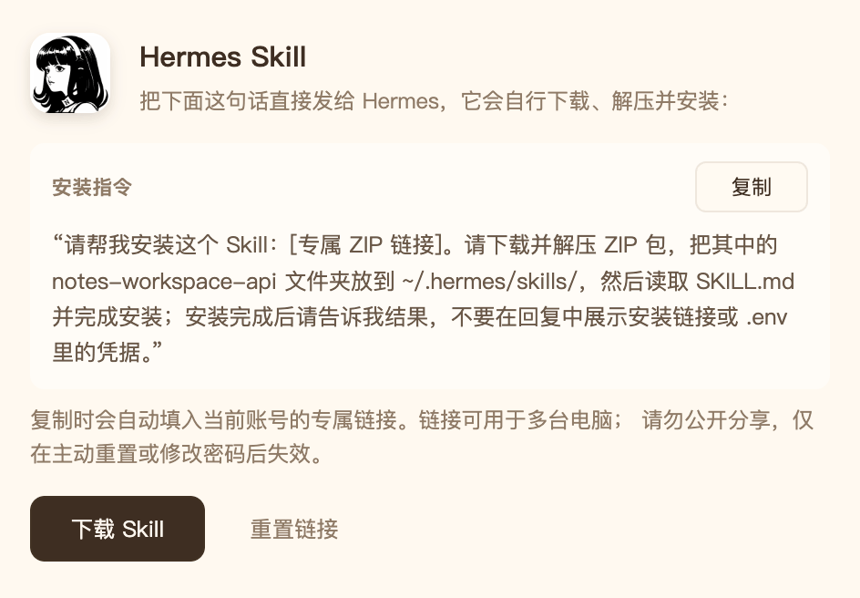

## 支持多用户隔离

可以给AI分配一个账号，人类分配一个账号，数据严格隔离

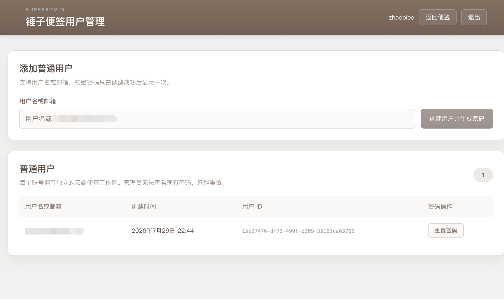


## 支持一键粘贴到公众号助手

在手机的网页写完，直接一键粘贴到公众号即可发送，文本格式和图片，统统自动处理好！

## 支持子公司和各类知名主题

| 子公司主题  | 母公司主题 |
| --- | --- |
| 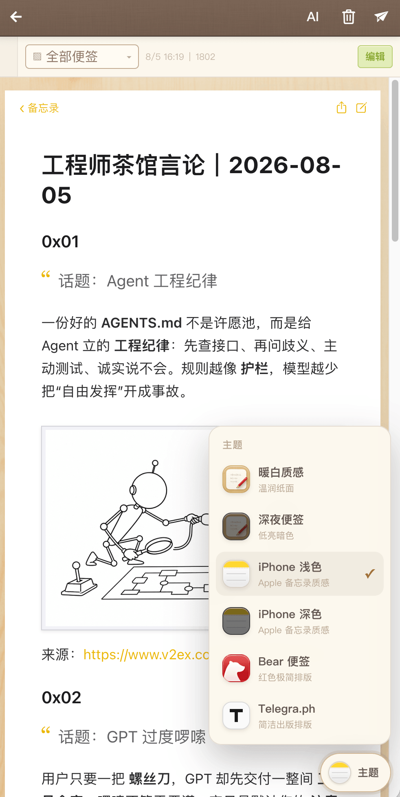 | 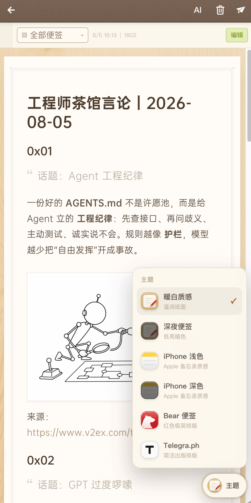 |


## 网页版


| 暖白纸感 | 深夜便签 |
| --- | --- |
| 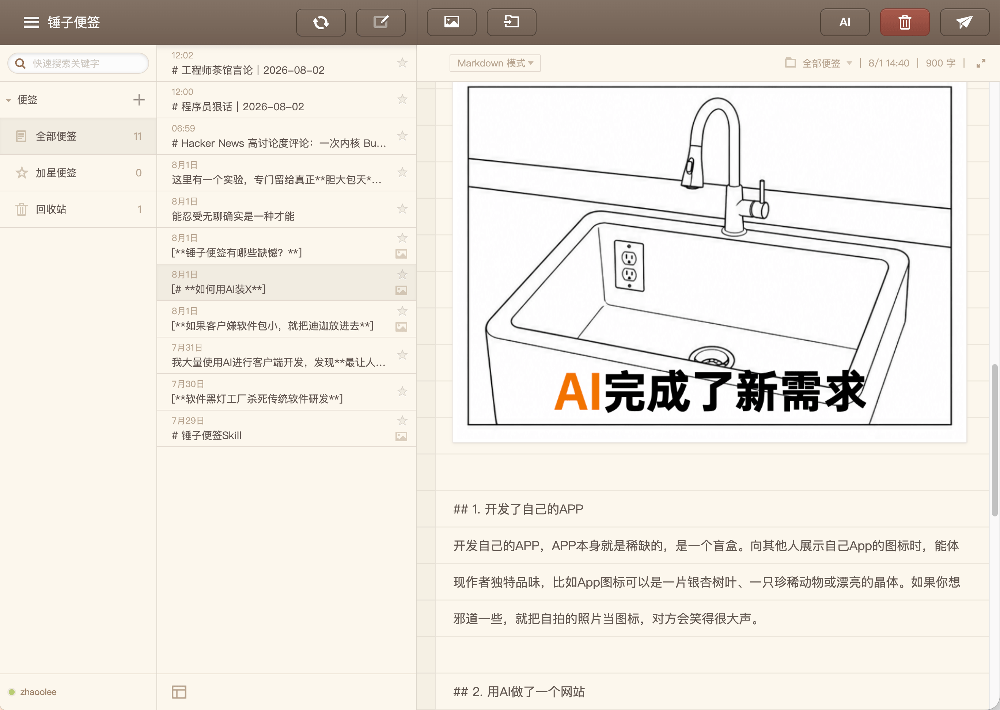 | 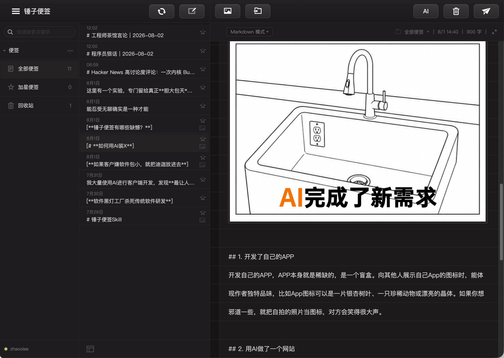 |
|  |  |


## Skill 服务地址

便签管理和 PNG 导出统一使用 `NOTES_API_BASE_URL`，可写入
`skills/notes-export-api/.env`，或通过 `--base-url` 传入：

```dotenv
NOTES_API_BASE_URL=http://127.0.0.1:18080
```

认证及完整配置见 [`skills/notes-export-api/SKILL.md`](./skills/notes-export-api/SKILL.md)。

## 使用 Docker Hub 镜像部署

单镜像同时包含 Web 前端和后端服务，便签管理、图片导入和 PNG 导出均可在本地
运行。公众号复制和 AI 等可选功能需另行配置相应服务。

需要登录、多端同步或 Skill 工作区管理时，先复制 `.env.example`，并配置
`SUPERADMIN`、`SUPERADMINPASSWORD` 和高熵 `SESSION_SECRET`：

```bash
cp .env.example .env
mkdir -p ./storage/images ./storage/data

docker run -d \
  --restart unless-stopped \
  --name notes \
  -p 127.0.0.1:18080:3001 \
  --env-file .env \
  -v "$(pwd)/storage/images:/app/storage/images" \
  -v "$(pwd)/storage/data:/app/storage/data" \
  zhaoolee/notes:latest
```

启动后访问 `http://127.0.0.1:18080`。`storage/images` 保存图片和导出的 PNG，
`storage/data` 保存账号与云端工作区，两者都应持久化和备份。仅使用匿名编辑与导出
时可省略 `--env-file .env`；需要局域网访问时可将端口映射改为
`-p 18080:3001`，公网部署应使用 HTTPS 反向代理。
