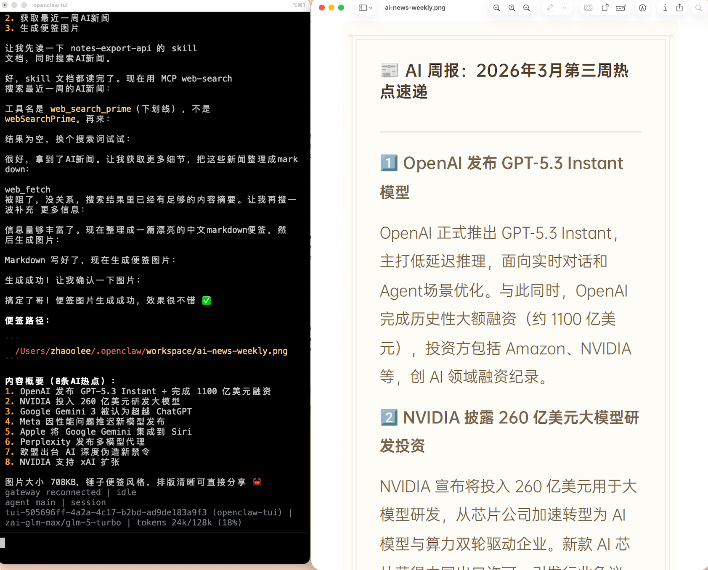
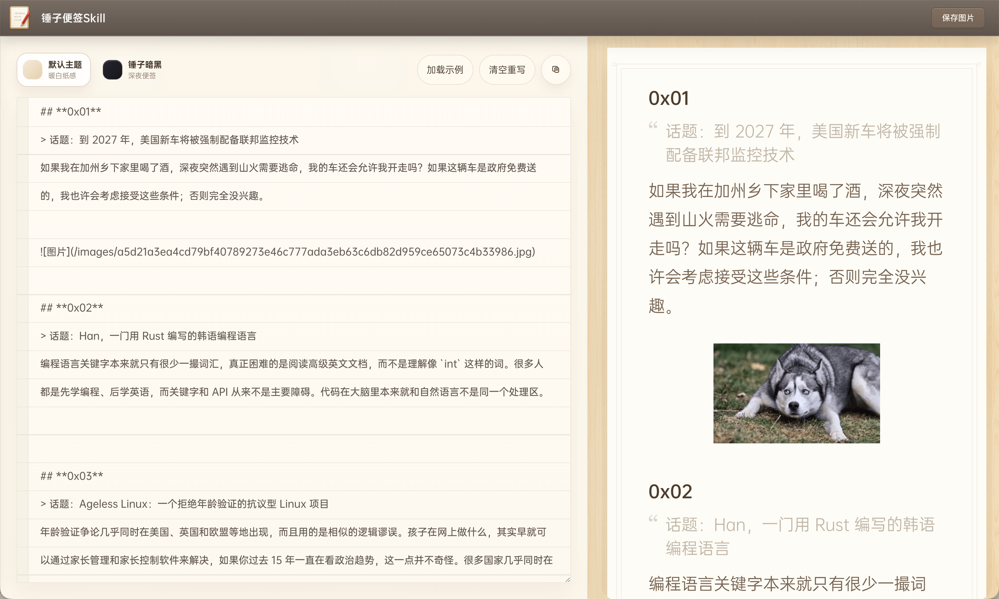
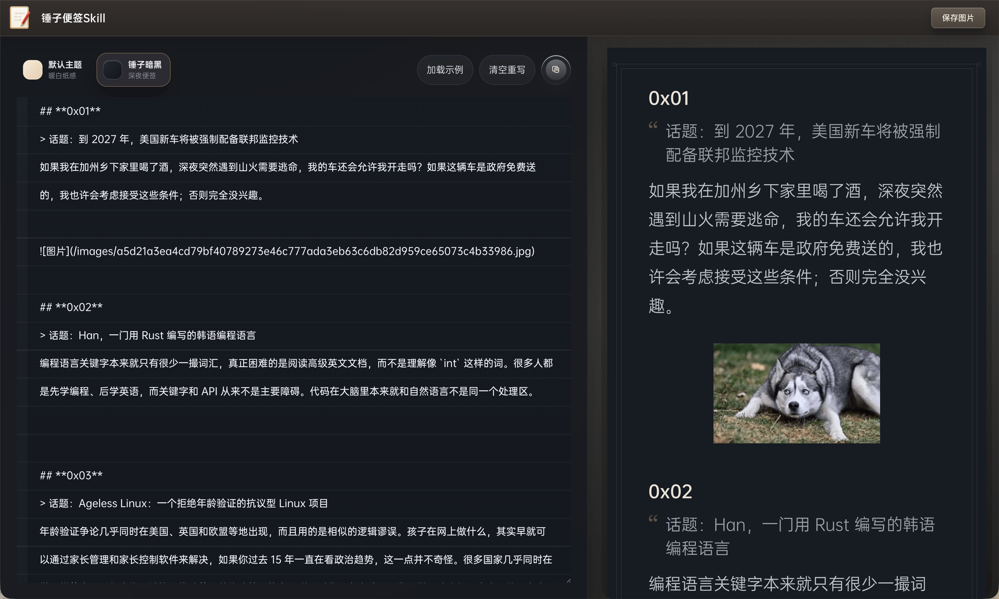
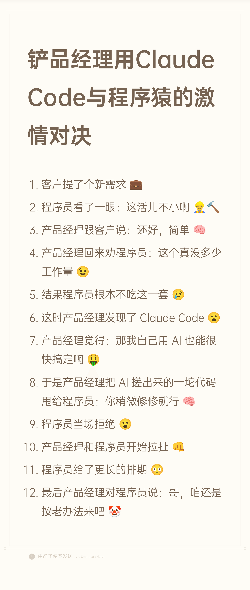
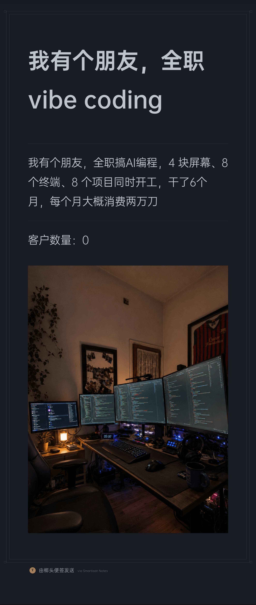

# 锤子便签Skill

- 一个锤子便签风格的导出器，支持**暖白纸感**，**深夜便签**两个主题。
- 可用来分享与openclaw的对话记录。
- 支持Docker一键私有化部署
- 纯WEB应用，无需安装任何App。
- 支持PC端和手机版，打开即用。
- 支持图片插入。
- 支持直接导出便签为图片，或复制为markdown格式进行分享。
- 自带浏览器持久化，关闭页面也不会丢失数据。
- 开源免费，可私有化部署。
- 工匠精神沁入AI，可以通过AI Skill直接调用工具，生成便签。
- 支持自定义底部标识（点击即可编辑）

## 通过skill调用

clawhub地址 https://clawhub.ai/zhaoolee/notes-export-api

```
从clawhub安装 notes-export-api这个 skill,
联网获取最近一周 AI 相关的新闻，将新闻转化为 markdown 生成便签图片，把便签图片绝对路径返回给我，把图片往“下载”文件夹复制一份
```



## 网页版

地址：[https://notes.fangyuanxiaozhan.com](https://notes.fangyuanxiaozhan.com)






## 支持自定义底部品牌标识

只要你喜欢，可以把底部的「锤子便签」改成「凿子便签」或「榔头便签」

| 凿子便签 | 榔头便签 |
| --- | --- |
|  |  |

## Skill去域名依赖说明

- Web 应用本体可完全本地自托管，不依赖 `notes.fangyuanxiaozhan.com`
- 现有 `notes-export-api` skill 脚本会优先探测本地生产入口 `18080`，再回退到线上演示地址
- 如果你希望 skill 固定走自建服务，可在 `skills/notes-export-api/.env` 中设置 `NOTES_EXPORT_API_BASE_URL=http://127.0.0.1:18080`


## 使用 Docker Hub 镜像部署本项目

这个项目已经支持打包为单个镜像，不依赖 `notes.fangyuanxiaozhan.com` 也能运行：

- 镜像内同时包含前端静态资源和后端导出服务
- 容器启动后直接访问 `http://127.0.0.1:18080`
- 导入图片和导出的便签 PNG 都会落在挂载出来的 `storage/images`
- 容器内部固定监听 `3001`，对外默认映射到 `18080`

使用 `docker run` 启动：

```bash
mkdir -p ./storage/images

docker run -d \
  --restart unless-stopped \
  --name notes \
  -p 18080:3001 \
  -v "$(pwd)/storage/images:/app/storage/images" \
  zhaoolee/notes:latest
```

说明：
- 使用 `--restart unless-stopped` 后，Docker/宿主机重启后容器会自动拉起；如果手动执行 `docker stop notes`，则不会被自动重启
- 若 `18080` 已被占用，可改成别的外部端口，例如 `-p 18081:3001`
- `storage/images` 建议挂载到宿主机，否则容器删除后上传图片会一起丢失
