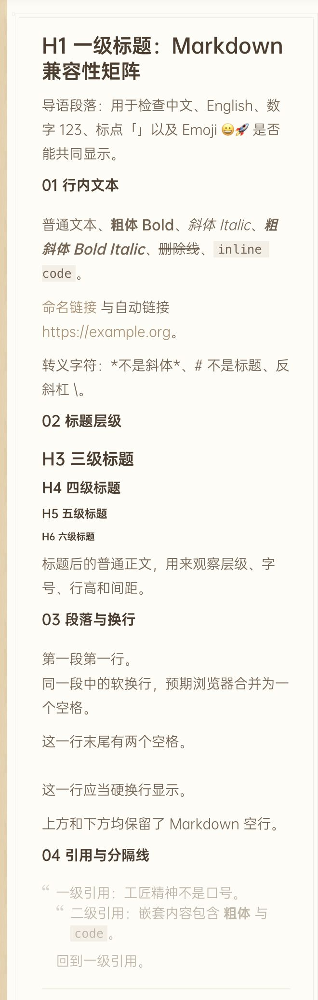
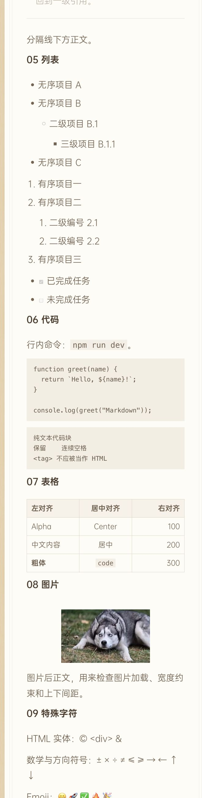
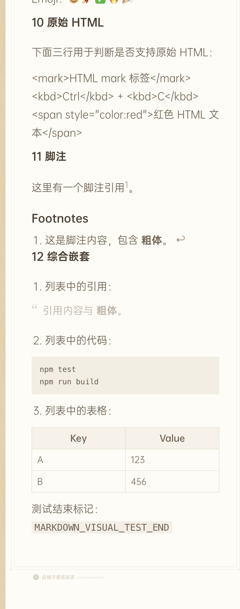

# Markdown 支持情况视觉测试报告

测试日期：2026-07-26

测试入口：`http://127.0.0.1:15173/?renderMode=playwright&theme=default`

测试数据：`frontend/tests/markdown-support-visual.md`

## 截图

### 文本、标题、段落与引用

### 列表、代码、表格与图片

### 原始 HTML、脚注与综合嵌套

完整长图：`artifacts/markdown-support-full.jpg`

## 测试结论

| 能力 | 结论 | 证据与评判 |
| --- | --- | --- |
| H1、H3-H6 标题 | 支持 | 均生成对应标题标签，层级可辨 |
| H2 标题 | 定制支持 | `##` 被项目拆分为便签区段标题，不再作为标准 `<h2>` 渲染 |
| 粗体、斜体、粗斜体、删除线、行内代码 | 支持 | 语义标签和视觉样式均正确 |
| 命名链接、自动链接 | 部分支持 | 链接正确生成，但颜色对纸张背景的对比度约为 2.93:1，且无下划线，辨识度不足 |
| 转义字符、实体、数学符号、Emoji | 支持 | 内容完整显示，HTML 实体正确解码 |
| 空行、硬换行 | 支持 | 空行得到保留，两个尾随空格生成 ` ` |
| 软换行 | 非标准行为 | 单个换行被项目插件拆成新段落行，而非 CommonMark 的空格合并行为 |
| 一级及嵌套引用 | 部分支持 | 结构和缩进正确；引用色对背景的对比度约为 1.97:1，长文可读性较弱 |
| 分隔线 | 支持 | 正常生成并显示 |
| 无序、有序及嵌套列表 | 支持 | 多级缩进和序号正确 |
| 任务列表 | 部分支持 | 复选框状态正确，但列表圆点仍保留，出现“圆点 + 复选框”重复标记 |
| 行内代码、围栏代码块 | 支持 | 保留换行和连续空格，并生成语言 class |
| 语法高亮 | 不支持 | 语言 class 存在，但项目没有代码高亮器，代码统一单色显示 |
| GFM 表格及对齐 | 支持 | 表格边框、粗体、代码及左中右对齐均正确 |
| 图片 | 支持 | 本地图片加载成功，原始尺寸 290×174，未溢出便签 |
| 原始 HTML | 不支持 | 标签按字面文本显示，没有生成 `mark`、`kbd`、带 style 的元素 |
| 脚注 | 部分支持 | 引用、正文和回链均生成；原本应隐藏的 `Footnotes` 辅助标题可见且未本地化 |
| 列表内引用、代码块、表格 | 支持 | 三种综合嵌套均能正确渲染 |

## DOM 统计

- 便签区段：13
- H1-H6：各 1 个，其中 H2 来自脚注辅助标题
- 引用：3，包含 1 个嵌套引用
- 任务复选框：2
- 围栏代码块：3
- 表格：2
- 分隔线：1
- 图片：1，加载成功
- 浏览器控制台警告和错误：0

## 总体评判

项目对 CommonMark 核心语法和 GFM 常用扩展覆盖较完整，正文、列表、代码、表格、图片及复合嵌套均可用于实际内容。主要短板集中在视觉可访问性和边缘语法：链接、引用对比度偏低，任务列表标记重复，软换行采用项目定制行为，原始 HTML 不支持，脚注辅助标题样式缺失。
